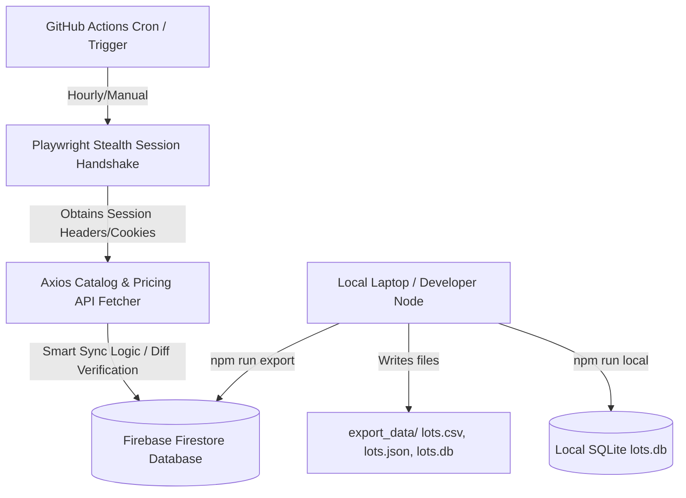

# Product Requirement Document (PRD) — HiBid Auction Scraper

## 1. Objective & Product Goals
The goal of this project is to build an automated, cost-free, resilient, and lightweight web scraper that pulls catalog data and real-time pricing from the weekly Discount Hunters auction hosted on HiBid.com.

### Core Goals:
- **Cloud Run (Zero Local Cost)**: Runs fully automated in the cloud without using local memory, battery, or disk space.
- **Zero Financial Cost**: Utilizes free-tier limits of GitHub Actions and Firebase Firestore.
- **Historical Price Logging**: Records a time-series history of price and bid updates for every lot.
- **Ease of Use**: Easily update the target auction catalog URL once a week.

---

## 2. System Architecture

The scraper operates on a hybrid cloud/local model:
- **Compute (GitHub Actions)**: Initiates a headless Playwright browser to solve Cloudflare checks and fetch session cookies, then switches to fast, direct Axios API queries to fetch catalog lists and prices.
- **Database (Cloud Firestore)**: Serves as the primary storage. Free tier (Spark plan) allows up to 20,000 writes/day.
- **Database (Local SQLite)**: If cloud credentials are not supplied, the adapter automatically writes locally to `lots.db`.
- **Local Exporter**: Downloads cloud data into Excel-compatible CSVs, JSON arrays, and a local SQLite database for offline analysis.

---

## 3. Data Schemas

### 3.1. Current Lot State (`lots`)
Maintains the most up-to-date state of each item in the auction.

| Field | Type | Description |
| :--- | :--- | :--- |
| `id` | String (PK) | Unique HiBid Lot ID. |
| `lotNumber` | String | Display lot number (e.g. `101`, `104B`). |
| `title` | String | Product listing title. |
| `description` | String | Product specifications, condition, and details. |
| `currentPrice` | Real | Active high bid. |
| `minBid` | Real | Next required minimum bid. |
| `bidCount` | Integer | Total bids placed. |
| `status` | String | `Open` (active bidding), `Closed` (ended). |
| `endTime` | String | Bidding close date/time. |
| `images` | Array | Full-size listing photo URLs. |
| `url` | String | Direct lot URL link. |
| `lastUpdated` | String | ISO Timestamp of latest check. |
| `isActive` | Boolean | True if present in the active catalog feed. |

### 3.2. Price History Log (`price_history`)
Tracks the time-series record of bidding events.

| Field | Type | Description |
| :--- | :--- | :--- |
| `historyId` | String (PK) | Auto-generated ID. |
| `lotId` | String (FK) | Reference to `lots.id`. |
| `price` | Real | Active bid price at the time of check. |
| `bidCount` | Integer | Total bids at the time of check. |
| `timestamp` | String | ISO Timestamp when change was detected. |

---

## 4. Key Requirements & Features

### R1. Anti-Bot Bypass
- Integrate Playwright with stealth configurations to bypass Cloudflare anti-bot checks.
- Safely extract session identifiers and user-agent details for downstream requests.

### R2. Smart Syncing (Quota Protection)
- **Full Sync**: Performed daily or manually to crawl static parameters (Title, Images, Description).
- **Price Poll**: Performed hourly (cloud) or 60s (local daemon) updating mutable variables.
- **History Change Detection**: Writes a history record *only* if `currentPrice` or `bidCount` has changed since the last database record. This prevents database bloat and ensures you stay well under the Firestore free quota.

### R3. Cloud Schedule and Manual Control
- Configured to run on GitHub Actions on a customizable schedule.
- Supports manual execution triggers through the GitHub Actions "Run workflow" UI.

### R4. Easy Config Rotation
- Configuration parameters (catalog URL) live in a single file `config.json` for straightforward updates.

---

## 5. Security & Isolation
- Credentials (Firebase keys) must never be committed to git. They must be injected via env variables (`FIREBASE_SERVICE_ACCOUNT`) locally or GitHub Actions secrets.
- Deleting the project root directory completely clears the project's footprint, ensuring no global system modifications.
